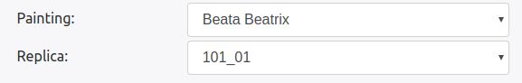
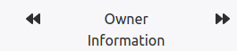
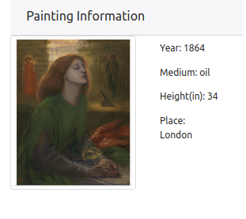

# Version 2 - Front End
In this knowledge of HTML, CSS3 and Javascript knowledge is assumed. The template we used for the version can be found [here](https://getbootstrap.com/docs/4.0/examples/jumbotron/). Most of the styling stuff is used from Bootstrap 4. If you are interested in styling changes visit `v2/index.html` and change accordingly with bootstrap.

#### File : v2/public/css/index.css

This file contains CSS 3 code for some of the utilities we used in developing visualisation. In the code we mentioned in the comments that for what widget/visualisation the styling is done. You can reference that. Here it is assumed that the developer knows CSS.

#### File : v2/public/js/chord_diagram.js
This file is imported in index.html and the code in this file is responsible for populating the data for chord visuals. 

Algorithm: 
It makes a hit on REST API: `/herberger/chordDiagram.php` to collect the data using Jquery get request.
The data is expected in following format
```json
    {
      "type" : "Success",
      "message" : "Data found",
      "data": {
          "matrix": { 
            "<year>":{
                "<Seller Name>" : {
                "<Buyer Name>": <How Many Paintings>
              }
            } 
         }
      }
    }
```

The data returned has a dictionary with keys as year numbers. We run a loop on the dictionary key to build each and every chord diagram. To build the chord diagram for every year range `build_chord` will run and it takes 3 parameters matrix(adjacency matrix for the graph), names(owners who were involved in the transactions) and id which will be used to fetch the specific `svg` for this chord. 
How an individual chord is created is a follows:

1. First the names are sorted on the basis of type of profession they are in. So dealers will have priority 1, museums will have priority 2 and individuals will have priority 3. 
1. Then we create a adjaceny matrix array as D3 requires that. 
3. Once that is done we have all the ingridients for the creating the d3 chord. If you don't know how to use D3 chord diagram follow this [tutorial](https://beta.observablehq.com/@mbostock/d3-chord-diagram).
1. To provide with the on hover lighting effect what we have done is we have set the opacity of the ribbons in the D3 chord with opacity 0.7. Once you hover over a ribbon the opacity is set to 1 which makes the ribbon prominent. Once you hover out the opacity is again set to 0.7.
1. It has built with traditional d3 visualisation so please follow the tutorial mentioned if you don't understand how to make d3 chord charts.

#### File : v2/public/js/comparisonTab.js

This file is also imported by index.html and the code in the file populates the Trajectory Comparison maps.
The data is expected in the following format.
```json
  {
    "type" : "Success",
    "message" : "Data found",
    "data": {
      "<Replica Id>": JSONArray([(Latitude), (Longitude), (Year), (Painting Type), (Size), (City)......])
    }
  }
```

Algorithm:

1. Whenever a user clicks on the left panel option `Trajectory Comparison` after 1 second the update is called. Why there is a delay because Leaflet, the library used for map visuals won't work properly if the maps are not visible and it takes time for browser to render things. So to compensate for that we put a delay.
1. Now how maps are populated is first `/herberger/getComparisonNetwork.php?name=<painting name>` is called using ajax get of jquery. Painting name is automatically picked from the dropdown and the content in the dropdown is populated in `v2/public/js/index/js`. 
1. The data collected is in form of key value pair where key is the replica id for the painting value is information array of different geographical information. This is sufficient to populate the data for Leaflet.
1. So based on number of replicas tiles are created and are populated with maps and trajectories. 
1. PS: onchange listener is active on the dropdown. This code will be available in this file. So if you change the dropdown the content updates. The id for the dropdown is `#comparisonPaintingPicker`.

#### File : v2/public/js/histograms.js

This file is also imported by index.html and the code in the fie populates the content for Histogram Visuals.

Algorithm:

1. A little knowledge on Highcharts.js is assumed here. If you don't know, you don't need to learn entire thing. Just read the options of [this](https://www.highcharts.com/demo/column-stacked-and-grouped) visualisation.
1. In the visualisation mentioned we have changed just the data and remaining things are same so it should be pretty starightford to build something in this domain.
1. If you add more excel sheets or plan to add more artists, you will need to update the content in the options of the Highcharts.js. It should automatically make the changes for you.

#### File : v2/public/js/mappingText.js

Some of the names in the excel sheets had complex names so those could not have been used as Directory names. So we created a function which on front end could map those name to the correct semantics. There is a function called `mappingName` in this file which takes a name and transforms it to original text. If you come accross such names use this function for that. 

#### File : v2/public/js/index.js

This file is responsible for populating data on the Narratives of the painting. But at the same time this file collects some data used in multiple places in the system. 

** Jquery Function **

The programming model used in the this file is Async waterfall model which gives as Asynchronous flow a synchronous touch (Trust me you need this one here). 

1. First thing the function does is it initialize the leaflet maps in `narrativeMaps` variable. It calls another function `initializeNarrativeMaps` which does that. It does that using `leaflet.js`. The reason this is done first is because `leaflet.js` with `openstreet maps` sometimes acts really funny and does not load the complete content. So please keep this order.
1. Next, it collects information about all the paintings from `/herberger/getPaintings.php` REST and populates them in `('narrativePaintingPicker', 'paintingsPaintingPicker', 'comparisonPaintingPicker', 'networkPaintingPicker')` which are ids of HTML select boxes. If you want to populate this data in more select boxes, just add that to the array in `allPaintingsSelectBox` function.
1. It calls `setReplicasForNarratives` which in itself has another waterfall model. In that waterfall two things are happening.
    1. The data(names) about replicas of a painting is collected using the REST `/herberger/getReplicaInfo.php`. This will be populated in 
    1. Next thing it populates the replica information by calling `updateReplicaInfo`. Where that function call does following jobs.
        1. Clear the previous leaflet markers if any. At cold start they would be empty
            
           ```
                $("#narrativesImage").attr("src", data['data']['image']);
                for (var iter = 0; iter < narrativeMarkers.length; iter++) {
                    narrativeMaps.removeLayer(narrativeMarkers[iter]);
                }
                narrativeMaps.removeLayer(narrativePolyLine);
                narrativeMaps.removeLayer(narrativeDecorator);
                narrativeMarkers = [];
                narrativeLatLngs = [];
           ```
        
        1. Update `ownerInfo` variable which keeps all the data for the current request. This is required as it stores the information for following navigations. 
        
        1. Populate the information of the painting
         
                   ```
                        var year = data['data']['csvData'][data['data']['csvData'].length - 1]['YEAR'];
                                        $('#narrativeYear').html('Year: ' + year);
                                        var medium = data['data']['csvData'][data['data']['csvData'].length - 1]['MEDIUM'];
                                        $('#narrativeMedium').html('Medium: ' + medium);
                                        var size = data['data']['csvData'][data['data']['csvData'].length - 1][' SIZE Height (in)'];
                                        $('#narrativeHeight').html('Height(in): ' + size);
                                        var location = data['data']['csvData'][data['data']['csvData'].length - 1]['owner_LOC'];
                                        $('#narrativePlace').html('Place: ' + location);
                   ```
            
                  
        1. After that, the information collected in `ownerInfor` is used to collect all the latitude and longitude to populate the markers on the maps. Those latitudes and longitudes are also used to create a polyline which presents the trajectory.
        
        1. Finally it calls the `moveOwnerCounter` which uses two variable `ownerInfo` and `ownerCounter` (at starting initialized to 0) and populates information on 
        
        
        Here a circular queue is used to move over different owners where `ownerCounter` keeps a check on which owner we are currently looking at.
        
1. If you see this code.    

    ```
    "$('#visuals_call').on('click', function () {
            setTimeout(function () {
                narrativeMaps.invalidateSize()
                narrativeMaps.fitBounds(group.getBounds())
            }, 500)
        });"
    ``` 
    
This is just to refresh the maps when the user clicks on visuals from the top menu. It makes sure that leaflet loads the maps properly.  


** getThisOut() and toggleInstruction() **  
These functions are simply showing the instructions in the modal when you click on
 


You should update them if you add more visualisations. Make sure when you add that button in html file you put a on click listener calling `getThisOut()`.  
    
#### File : v2/public/js/datatablesSetup.js
This javascript file is responsible for `Collection Browser` tab. It uses [multiselect](http://loudev.com/) and [datatables](https://datatables.net/) to do that. They are pretty standard libraries and most of the configuration that we use is by default configuration of those to libraries. 

1. The first thing this script does is that it collects the information from `/herberger/getRawData.php`. 
1. Next thing it does is that it initializes the `.multi-select` class. To know which classes belong to this CSS class, go to `v2/index.html` and look for `multi-select` class objects. All of them are wrapped into a `div`. It should be easy to find. The configuration is by default same as multiselect but in `afterSelect` and `afterDeselect` just one function call is added `updateSearchCriteria` which will be explained later. 
1. After that all the data is inserted in the datatable in the following code snippet.

        for (iter in data) {
           
            $('#rawDataSrc').append('<tr><td>' + data[iter]['paintingName']
                          + '</td><td></td><td>'
                          + data[iter]['replicaId'] + '</td>' +
                          '<td>' + data[iter]['ownerNumber'] + '</td>' +
                          '<td>' + data[iter]['ownerName'] + '</td>' +
                          '<td>' + data[iter]['ownerCity'] + '</td>' +
                          '<td></td><td>' + data[iter]['ownerProfession'] + '</td></tr>')
                               }
                               
1. To update data on `Advance Filters` we will use Datatables search mechanism. 
1. First we update the search criteria in `updateSearchCriteria` function.
    1. First it starts with initializing variables
    
        ```
        var array = {
                                    '#paitingFilter': true,
                                    '#replicaFilter': true,
                                    '#owernFilter': true,
                                    '#professionFilter': true,
                                    '#ownerCityFilter': true,
                                    '#ownerNumberFilter': true
                                };
        ```
        
        This is just saying we need to update the following `ids`.
        
    1. Then we look at multiselect ids if they are set or have some values then the respective multiselect does not need to be udpated. Plus those who need to be updated we change there values in the following code.
        
                                for (iter in data) {
        
                                    if (($('#paitingFilter').val().length == 0 || $('#paitingFilter').val().indexOf(data[iter]['paintingName']) != -1)
                                        && ($('#replicaFilter').val().length == 0 || $('#replicaFilter').val().indexOf(data[iter]['replicaId']) != -1)
                                        && ($('#professionFilter').val().length == 0 || $('#professionFilter').val().indexOf(data[iter]['ownerProfession']) != -1)
                                        && ($('#owernFilter').val().length == 0 || $('#owernFilter').val().indexOf(data[iter]['ownerName']) != -1)
                                        && ($('#ownerCityFilter').val().length == 0 || $('#ownerCityFilter').val().indexOf(data[iter]['ownerCity']) != -1)
                                        && ($('#ownerNumberFilter').val().length == 0 || $('#ownerNumberFilter').val().indexOf(data[iter]['ownerNumber']) != -1)) {
                                        ownerNames[data[iter]['ownerName'].trim()] = true;
                                        paintingNames[data[iter]['paintingName'].trim()] = true;
                                        replicaIds[data[iter]['replicaId'].trim()] = true;
                                        professions[data[iter]['ownerProfession'].trim()] = true;
                                        ownerCity[data[iter]['ownerCity'].trim()] = true;
                                        ownerNumber[data[iter]['ownerNumber'].trim()] = true;
                                    }
                                }
                                
    1. That will collect new data if something has been selected and changes are required in advance filter column.
    1. PS the data is not update yet in datatables yet. When the user will click on the `Apply` button, the information that has been just update in advance filter column that will we used in `Search` features of the datatables. I have used `$.fn.dataTable.ext.search.push` call in `searchRawData` which is a `Datatables` api. That will update the raw data content. 
    
1. Some of the datatables configuration that have been changed are as follows.
```
{
    paging: true,
    columnDefs: [
        {
            width: 200,
            targets: [0, 1, 2, 3, 4, 5]
        }
    ],
    "searching": true,
    fixedColumns: true
}
```

#### File : v2/public/js/transactionNetwork.js

This file populates the data on the transactional network tab. It has one function which encapsulates all the work for this visualisation. That function is called from `v2/public/js/index.js` as some of the data required by this visualisation can be reused from the data collected in narratives. The function is `startNetorkSimulation`. The idea of this visualisation is taken from followind `D3` visuals.
 
    * https://bl.ocks.org/puzzler10/4438752bb93f45dc5ad5214efaa12e4a (A simple D3 force directed graph)  
    * http://bl.ocks.org/eyaler/10586116 (Highlighting of the nodes)
    * https://bl.ocks.org/denisemauldin/cdd667cbaf7b45d600a634c8ae32fae5 (The filtering of nodes).


1. It starts with `setReplicasForNetwork` function inside `startNetorkSimulation` where it collects the data. Now if a painting is selected then `getSocialNetworkData.php` will be called else `allSocialNetwork.php` will be called. Also there is a Jquery `timeslider` which tells from which year to which year the data is required. 
1. The data that is returned from the REST end is configurable straight into the d3 code. Once that data is collected `update_node_data_filter` is called which propogates the `create`, `update`, `delete` flow of the d3.js.
1. Most of the idea is taken from the links above, but, one feature that we added which is different from that is the tooltips. For that what we do is we collect all the network information of the node when you hover on the node in the following code.

    ```
link.style('stroke-width', function (l) {
    if (mapping.indexOf(l['replicaId']) != -1) {
        if (l.source !== d) {
            if (array.indexOf(l.source) === -1) {
                l.source.s = new Set();
                l.source.s.add(l['replicaId']);
                array.push(l.source);
            } else {
                var index = array.indexOf(l.source);
                array[index].s.add(l['replicaId']);
            }
        }
        if (l.target !== d) {
            if (array.indexOf(l.target) === -1) {
                l.target.s = new Set();
                l.target.s.add(l['replicaId']);
                array.push(l.target);
            } else {
                var index = array.indexOf(l.target);
                array[index].s.add(l['replicaId']);
            }
        }
        return 4;
    }
    else {
        return 1;
    }
});
    ```
    
1. The `array` in the above code is collecting all the nodes which should have higher opacity as well as changes the stroke width to 4 of the links which are a part of the network of that node on which you hovered on.
1. In that same mouseover call a loop over all the nodes is started and all the nodes of the `array` are given a higher opacity value and others are made translucent. While that is a done a rectangle and text is also appended to the nodes which have higher opacity which acts as a tooltip. 
1. Once you move the mouse out of the node the node, all the changes are reverted back. Nothing fancy just plain old javascript functionality doing the trick.
1. Some function `toggle_museum`, `toggle_auction`, and `toggle_individual` as the name implies are used to toggle the display of the types of the nodes in the graph. 

#### File : v2/index.html

I wanted to mention some points regarding the content in the html file.

* There is some textual content (Bibliography, Methods and Instructions etc) which was provided by Professor Julie Codell. For that I used free online (tool)[https://document.online-convert.com/convert-to-html] which can convert a docx to html. PS: only the textual content is converted and not the literature of the research. Make sure you do the same.
* The template used is Bootstrap 4 template. 
* Most of the styling done is pretty basic and easy to understand bootstrap syntax. 

